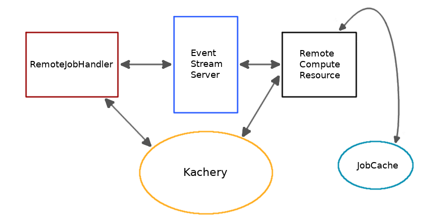

# Remote Compute Resources

## Definition

A "remote compute resource" is a **compute resource** (physical or virtual
machine) which is configured to receive and run hither Jobs dispatched over
the network from another location. Typically this will be a machine with
more computational power than the researcher's own development machine,
such as a central workstation vs. a laptop.

Compute resources hosted on a computer attached to a Slurm-enabled cluster can be configured to use Slurm; see [TODO SLURM DOCUMENTATION]().

## Benefits

Setting up a remote compute resource facilitates the use of more powerful
(usually shared) resources to run hither Jobs. It also allows multiple
researchers with multiple machines to run hither jobs against
a single compute resource, centralizing the acquisition and maintenance
of higher-capacity compute resources.

It can also be used to allow computational results to be available
on demand to a resource whose primary responsibility is
something like serving web pages. There's no reason to provision a web
server to do high-powered computations for a monthly or weekly update of results, but
it would also be burdensome to attempt those computations on an underpowered
machine, or to require scaling a virtual resource up and down in order to
handle occasional processing jobs.

## Architecture

As the above diagram shows, a distributed hither setup suggests four or five main components. In the simplest
setup (such as for testing) these could all be running on the same machine, though in real
deployments, the remote job handler (at a minimum) should be separate from the others--otherwise
a simpler `ParallelJobHandler` could be used. Alternatively, each component
can be run separately, on hardware particularly suited to its needs.

- **Remote Job Handler**

This is usually running on what you'd think of as 'your' machine or a 'local' machine, like
a researcher's individual laptop; or a lightweight resource that needs to coordinate hither
Jobs and interact with their results, like a web server with a scheduled job that updates
the results of several functions on a regularly updated data set.

- **compute resource**

This is the server (perhaps connected to a cluster) which will actually execute hither Jobs. Its provisioning needs
will be determined by the requirements of the underlying Jobs being run on it.

- **job cache** (optional)

The [job cache improves efficiency](./job-cache.md) by recording the results of Jobs
which have already been executed, and returning the recorded result instead of re-running a
Job whose outcome has already been determined.

Use of a job cache is optional. If it is omitted, a Job will be rerun every time it
is requested. If it is used, results of Jobs are stored and retrieved on subsequent runs of an identical Job (same function name, version, input file hashes, and parameters). If multiple compute resources are used, it is advisable to
ensure that they all point to the same job cache,
unless there is a compelling reason to do otherwise.

## Setup

The recommended way to set up a remote compute resource is
to use the `hither-compute-resource` tool distributed with this
package. See [full instructions](./hosting_compute_resource.md) here.

The only requirements are that the remote resource have stable network access
and that the user or service account running the compute resource manager
have rights to run python and Docker on the resource.

## What runs on the Remote Compute Resource?

The remote compute resource will run at least the following:

- A running kachery daemon
- An instance of the compute resource server, which communicates with the
over the kachery network to coordinate Job dispatch and return results;
- A `ParallelJobHandler` or `SlurmJobHandler` (usually) which actually manages execution
of individual Jobs on the compute resource; and
- A container execution environment (Docker or Singularity).

It is expected that the container images supplied with the hither functions
will contain a python interpreter or whatever other environment is needed
to run the Jobs themselves.

## Remote Compute Resources and Job Cache

Any job cache configured for the compute resource must be set up
in the `compute_resource.json` configuration file on the compute
resource itself. The local machine--the one running the
`RemoteJobHandler`--does not directly configure the remote compute
resource used remotely.

TODO: __Allow implement user configuration of the job cache on the remote resource__

It is recommended that if multiple
compute resources (local or remote) are used with the same pipeline, they all
point to the same job cache.

TODO: need to discuss recommendations regarding multiple compute resources.
